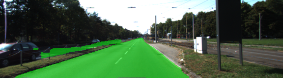
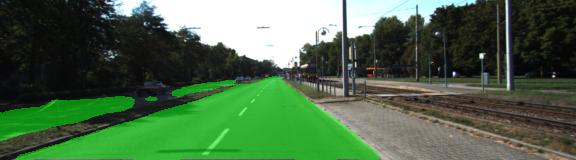
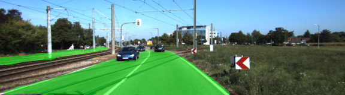
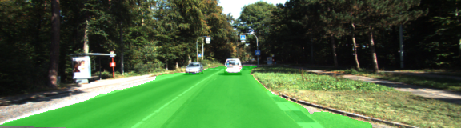
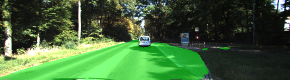
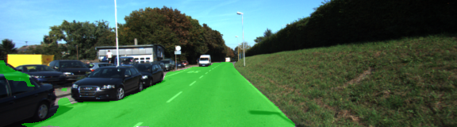

# Semantic Segmentation
### Introduction
In this project, you'll label the pixels of a road in images using a Fully Convolutional Network (FCN).

### Setup
##### Frameworks and Packages
Make sure you have the following is installed:
 - [Python 3](https://www.python.org/)
 - [TensorFlow](https://www.tensorflow.org/)
 - [NumPy](http://www.numpy.org/)
 - [SciPy](https://www.scipy.org/)
##### Dataset
Download the [Kitti Road dataset](http://www.cvlibs.net/datasets/kitti/eval_road.php) from [here](http://www.cvlibs.net/download.php?file=data_road.zip).  Extract the dataset in the `data` folder.  This will create the folder `data_road` with all the training a test images.

### Writeup

1. load_vgg
	- load the graph from file and call the tensor by their names and return each one

2. layers
	- Where the fun happens, implement the architecture found in the class FCN-8-Decoder
		- create the 1x1 conv with regularization to not overfit
		- take the conv 1x1 as input to the next layer and up sample by 2
		- check the shapes in anew layer and add both layers
		- use the output to input in the next up sample by 2
		- again apply 1x1 on the the layer just created
		- skip connection by adding the layers
		- create the ouput by up sample by 8

3. optimize
	- I use the clss FCN-8 classification and loss as a walk-through to apply the optimizer
	- Rezised the logits to 2D from previous 4D, flatting it.
	- Used the softmax with the logits to create the loss function
	- Used Adam optmizer to define the training operation, feeding the cross entropy loss

4. training
    - Initialize the variables
    - loop through the epochs and loop through the batches using the get_batches_fn(batch_size)
    - with all the information we do the training setting the loss

5. run
    - define the tensorflow placeholderss for the correct_label and learning_rate
    - we load de VGG layers, and the optimizer and send them to the training function
    - last we Save the inference data using helper.save_inference_samples

some outputs:

-
-
-
-
-
-
-

